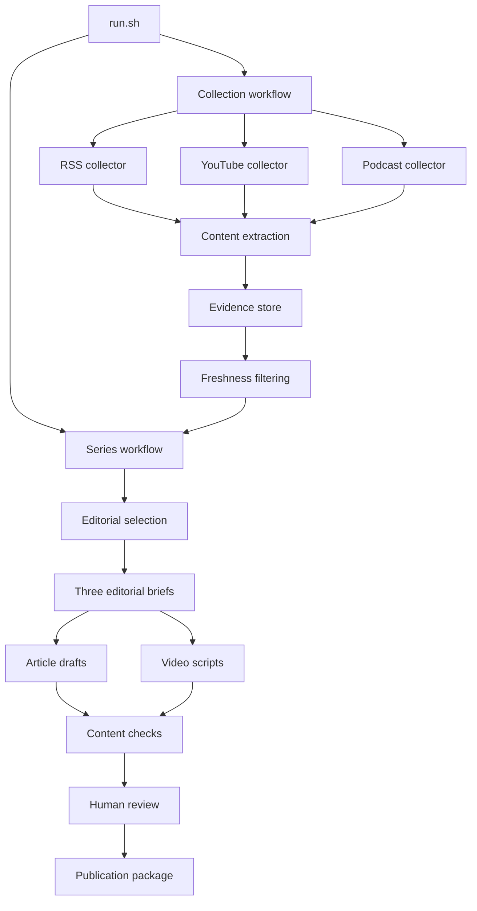

# Intelligence Pipeline Architecture

This is the required architecture for MIT 1.125 Problem Set 4. Read the [assignment README](README.md) for the topic, evidence, publication, and grading requirements. Record your project details in [SUBMISSION.md](SUBMISSION.md).

**All 16 Bash files are intentionally empty.** Implement them yourself. An empty Bash file can exit successfully without doing anything; completion requires the specified behavior and artifacts. The examples are fictional interface illustrations, not assignment evidence or a working solution.

Keep the required files and contracts below. You may add focused helpers and optional sources. Keep provider choices, editorial policy, and creative decisions your own.

## Architecture



The two workflows coordinate their components. `reporting/summarize_run.sh` reports results from all stages. The assignment lists every required file; the component contracts below define what each implements.

## Running the completed project

Run commands from the repository root. After implementing the files, start a new run with:

```bash
bash run.sh
```

This must collect evidence, produce the series, run checks, and stop for human editorial review. After any necessary revisions, rerun checks, record your review, and prepare the production package with:

```bash
bash run.sh --package runs/RUN_ID
```

Replace `RUN_ID` with an actual run directory. Packaging must not recollect sources or regenerate approved drafts.

Use Bash for orchestration and component entry points. Add an appropriate Bash shebang when implementing each file. Helpers in other languages are allowed when they remain within the owning component's responsibility. A component must do its assigned work, not route every request into a single application that owns the entire pipeline.

## Configuration and prompts

Populate these files before a live run:

| File | Required content |
| --- | --- |
| `config/project.json` | `publication_name`, `topic`, `audience`, and `central_question`, all nonempty strings. |
| `config/sources.json` | An array of source definitions with `source_id`, `publisher_id`, `kind`, and `url`. `kind` is `feed`, `youtube`, or `podcast`. |
| `config/editorial_policy.md` | Your rules for relevance, freshness, credibility, novelty, perspective, uncertainty, and exclusions. |
| `prompts/select_items.md` | Instructions for applying the policy and explaining each decision. |
| `prompts/create_briefs.md` | Instructions for creating three distinct arguments and linking claims to evidence. |
| `prompts/write_articles.md` | Instructions for turning a brief into an article for the chosen audience. |
| `prompts/write_video_scripts.md` | Instructions for turning the same brief into an audience-facing video script. |

Each source definition is a feed, channel, playlist, individual video, or podcast feed supported by the corresponding collector. `publisher_id` identifies the originating publisher or producer; several endpoints from the same producer must share it. Explain your independence judgments. Additional fields are allowed. See `examples/sources.json` for the shape, using deliberately fictional URLs.

Use environment variables for credentials. Document required tools, dependencies, models, and provider settings in your submission. Do not put credentials in configuration snapshots or logs.

## Common interfaces

- Every stage receives `RUN_DIR` as its first positional argument, except `data/store.sh`, which uses the subcommands below. `run.sh` creates the directory. Examples use `runs/RUN_ID`.
- Record streams use **JSON Lines**: one JSON object per line. JSON documents, Markdown drafts, and transcript arrays have the extensions shown below. Preserve required field names, types, and meanings; extra fields are allowed.
- Send record output to `stdout` and diagnostic messages to `stderr`. Files listed as side effects belong under the run directory or the documented source asset directories.
- Use repository-relative paths in records. Store timestamps as ISO 8601 UTC strings. Use `null` for unknown publication dates and absent optional paths; do not invent values.
- Exit `0` for a completed stage, `1` for an operational failure or incomplete collection, and `2` for invalid arguments, configuration, or malformed input. A completed search with no results is distinct from a failed search.
- Each invocation writes a uniquely named receipt under `RUN_DIR/logs/`. Include stage, status, input and output counts, start and finish times, tools or models, cost in USD, and errors when applicable. Use `null` for unknown cost and indicate estimates. Preserve earlier receipts when rerunning a stage.
- Collectors may leave valid partial results when they fail. The collection workflow must preserve their exit status and errors, continue with usable results where possible, and report incomplete coverage. Do not represent failed collection as a successful empty result.
- Save the exact configuration and prompts used in `RUN_DIR/config/` and `RUN_DIR/prompts/`. Components read these snapshots. For a policy comparison, create a new run or preserve both versions and their separate outputs.

## Run artifacts

The implementation must produce these paths. A stage that has not completed may leave its output absent; the summary must explain the state.

```text
runs/RUN_ID/
├── run.json
├── config/
├── prompts/
├── logs/
├── candidates/
│   ├── feeds.jsonl
│   ├── youtube.jsonl
│   └── podcasts.jsonl
├── candidates.jsonl
├── items.jsonl
├── changes.jsonl
├── corpus.jsonl
├── eligible.jsonl
├── exclusions.jsonl
├── decisions.jsonl
├── briefs.jsonl
├── articles.jsonl
├── articles/01.md, 02.md, 03.md
├── video_scripts.jsonl
├── video_scripts/01.md, 02.md, 03.md
├── review.json
├── approval.json
├── summary.json
└── package/
```

`run.json` contains `run_id`, `started_at`, `as_of_date`, `mode`, and `previous_run_id` (or `null`). For live runs, `mode` is `live` and `as_of_date` is the actual UTC execution date. Capture it once at the beginning. Use unique run IDs and preserve prior runs. Mark fixture demonstrations as `example` or `replay`; they do not replace the two live runs required by the assignment.

Keep original downloads in `data/media/` and retained text and transcript segments in `data/assets/`. Never overwrite an asset referenced by a previous run. The canonical evidence index belongs in `data/evidence/`, which may contain SQLite or another documented representation. The starter does not pre-create runtime directories or databases.

## Component contracts

### Entry point and workflows

**`run.sh`** validates configuration, creates the run metadata and snapshots, initializes the store, and calls the collection and series workflows. It saves the summary last, including when a stage fails. It prints the resulting summary JSON to `stdout`. Keep collection, storage, model reasoning, and rendering logic in their assigned components.

When checks pass and drafts exist, the normal run ends with `awaiting_review`. The `--package RUN_DIR` mode reruns content checks, invokes `prepare_package.sh` for matching human approval, and refreshes the summary. It must leave drafts and source snapshots unchanged.

**`workflows/collect_sources.sh RUN_DIR`** calls all three collectors, saving their separate streams and combining valid records into `candidates.jsonl`. It then coordinates these steps:

1. `extract_content.sh` reads candidates and produces `items.jsonl`.
2. `store.sh upsert RUN_DIR` reads items and produces `changes.jsonl`.
3. `store.sh list` exports the latest stored versions to `corpus.jsonl`.
4. `filter_items.sh` reads that corpus and produces `eligible.jsonl` and `exclusions.jsonl`.

Use at least one real pipe between compatible components or a component and its input reader. You may run independent collectors concurrently; preserve separate output files and receipts. The workflow owns sequencing and failure handling, not the implementations of these steps.

**`workflows/create_series.sh RUN_DIR`** coordinates `select_items.sh`, `create_briefs.sh`, both content generators, and `check_content.sh`. It saves each named artifact before continuing. It must not silently create unsupported briefs when the eligible evidence is insufficient. A failed requirement must be reported for repair; do not fill gaps with invented sources.

### Collection and preparation

| Command | Input | Output and responsibility |
| --- | --- | --- |
| `collectors/fetch_feeds.sh RUN_DIR` | Configured `feed` sources in the run snapshot. | Candidate JSONL on stdout for written articles. Resolve source URLs, publication dates, and stable identities. |
| `collectors/fetch_youtube.sh RUN_DIR` | Configured `youtube` sources. | Candidate JSONL on stdout for videos, with native video identities and publication metadata. |
| `collectors/fetch_podcasts.sh RUN_DIR` | Configured `podcast` sources. | Candidate JSONL on stdout for episodes, including the audio enclosure URL. |
| `processing/extract_content.sh RUN_DIR` | Candidate JSONL on stdin. | Normalized item JSONL on stdout; retained content and transcript assets on disk. Fetch full written content or media, obtain or generate transcripts, and preserve segment timestamps. Report inaccessible or unprocessable items in receipts. |
| `processing/filter_items.sh RUN_DIR` | Item JSONL on stdin, normally `corpus.jsonl`. | Eligible item JSONL on stdout and exclusion records in `RUN_DIR/exclusions.jsonl`. Apply dates and identify invalid or unknown dates. This is a mechanical eligibility check; editorial relevance belongs to `select_items.sh`. |

Reuse saved extraction results when the underlying material is unchanged. Query the store through its interface. Retrieving a page again is not evidence that its content changed. A YouTube upload and a podcast copy of the same recording must resolve to one underlying item or be explicitly reconciled before counting evidence.

For an as-of date `D`, the inclusive date window is **D minus 29 days through D**, giving 30 calendar dates in UTC. Retained material from prior runs must be checked again against the new window. Reasons in exclusions include `outside_window`, `unknown_date`, `future_date`, or `invalid_date`. Previously seen eligible material remains usable; it is not excluded merely because it is unchanged.

### Evidence storage

**`data/store.sh`** is the only component that directly reads or writes `data/evidence/`. Other stages may read retained source assets and their own run artifacts. Implement these commands:

| Command | Behavior |
| --- | --- |
| `bash data/store.sh init` | Create missing storage without erasing existing evidence. No record output. |
| `bash data/store.sh upsert RUN_DIR` | Read item JSONL from stdin. Save new items or versions and emit one change record per input record, in input order. Repeated input must not create duplicate items or versions. |
| `bash data/store.sh list` | Emit one latest-version item record per `item_id`, including older material for the filter to assess. |
| `bash data/store.sh get ITEM_ID [VERSION_ID]` | Emit one matching item; omit the version to request the latest. Return exit `1` and a diagnostic when absent. |

A change record contains `item_id`, `version_id`, and `change` equal to `new`, `changed`, or `unchanged`. For identical repeated input in one ingestion, only the first occurrence can be new or changed. Preserve a history of versions and their associated runs. Updating a retrieval timestamp alone must not create a new evidence version.

### Editorial decisions and content

| Command | Input | Output and responsibility |
| --- | --- | --- |
| `editorial/select_items.sh RUN_DIR` | Eligible item JSONL on stdin. | Decision JSONL on stdout, one per eligible item. Supply the snapshotted policy and prompt to the AI. Record accept, reject, or defer with reasons and intended pieces. |
| `editorial/create_briefs.sh RUN_DIR` | Decision JSONL on stdin; the run's eligible evidence and project brief. | Exactly three brief records on stdout, with piece IDs `01`, `02`, `03`. Use accepted material to develop distinct arguments, explicit claims, synthesis, and limitations. |
| `content/write_articles.sh RUN_DIR` | Brief JSONL on stdin. | Article manifest JSONL on stdout and `RUN_DIR/articles/01.md`, `02.md`, `03.md`. Read the evidence behind each brief. Preserve claim and evidence references. |
| `content/write_video_scripts.sh RUN_DIR` | The same brief JSONL on stdin. | Script manifest JSONL on stdout and `RUN_DIR/video_scripts/01.md`, `02.md`, `03.md`. Produce narration, useful visual directions, and source references suitable for Google Vids or HeyGen. |

Mechanically excluded items already have reasons in `exclusions.jsonl`. Editorial decisions cover the remaining eligible items, including rejections and deferrals. Treat selection reasons as decisions to inspect, not proof of credibility. Cite the exact source version used, so future updates do not silently change a published claim's evidence.

Each manifest record contains `piece_id`, `path`, and `claim_ids`. Make claim markers such as `01-c1` inspectable in the drafts and scripts. Resolve these to links or a source note in the audience-facing publication; internal IDs alone are not useful citations for readers.

### Review and publication handoff

**`review/check_content.sh RUN_DIR`** reads the briefs, manifests, drafts, scripts, and referenced evidence. It emits one JSON object to stdout, saved as `review.json`, containing `review_id`, `passed`, and `issues`. Check required files, three distinct pieces, resolvable references, dates, source counts, media coverage across the series, and consistency between articles and scripts. Include warnings for approximate length targets and matters requiring human judgment. Each issue identifies its piece or artifact, severity (`error` or `warning`), and explanation.

The check invocation exits `0` when it successfully completes an assessment, even when `passed` is false; callers must inspect the result. Reserve operational failure codes for an assessment that could not run. Set `passed` to false for blocking errors. A machine check cannot establish that an interpretation is sound; human review remains required.

`review_id` must fingerprint the assessed drafts, briefs, evidence references, and as-of date. It must change if those inputs change. After reviewing the actual material, create `RUN_DIR/approval.json` with `review_id`, `decision` (`approve` or `revise`), `reviewer`, `reviewed_at`, and `notes`. Record corrections and their reasons. See the example shape. Only the student supplies this human decision.

**`publishing/prepare_package.sh RUN_DIR`** requires a passing current review and matching human approval. Verify that the reviewed inputs are unchanged, including when this component is invoked directly. Otherwise report what is missing or stale and return exit `1`. When approved, create `RUN_DIR/package/` with three article files, three video scripts, source notes for each piece, and `manifest.json` listing those assets and their piece IDs. Emit that manifest JSON on stdout.

The package must state which manual steps remain for Google Vids or HeyGen, Substack, and YouTube. Include `publication_links.json` with one record per piece containing `piece_id`, `substack_url`, and `youtube_url`; initialize unpublished URLs to `null`. The student fills real links after publication. Preparing a package does not mean the videos have been rendered or the series published. Repackaging an unchanged run must preserve entered publication links.

### Reporting

**`reporting/summarize_run.sh RUN_DIR`** reads saved run artifacts and receipts and emits summary JSON on stdout. It must work for incomplete runs. Include `run_id`, overall `status`, counts for discovered, extracted, new, changed, unchanged, eligible, excluded, accepted, rejected, and deferred items, and article and video-script counts. Also report source coverage by kind and independent publisher, failed or incomplete stages, elapsed time, model/tool use, known or estimated costs, unknown costs, and remaining manual actions. Count distinct underlying items for evidence coverage. Report duplicate observations separately when they inflate raw collection counts.

Use overall status `failed`, `awaiting_review`, or `ready_for_production`. Use `null` for counts from stages that did not run; use zero for a measured empty result. Coverage limitations remain explicit even if processing continued. Record published links separately from production readiness. Do not claim that a stage ran, a cost was zero, or content was published merely because a field or file is absent.

## Shared record definitions

The small files in `examples/` illustrate these contracts. They contain only a few fictional records and do not satisfy the assignment's quantity or publication requirements.

| Record | Required fields |
| --- | --- |
| Candidate | `item_id`, `source_id`, `publisher_id`, `kind`, `title`, `url`, `published_at`, `retrieved_at`, `media_url`. Use `null` when no direct media URL is available. |
| Item | All candidate fields plus `version_id`, `text_path`, and `segments_path`. Written material has `segments_path: null`; audio and video must have segment files. |
| Transcript segment | `segment_id`, `start_seconds`, `end_seconds`, `text`. Save an array of segments at the referenced path. |
| Exclusion | `item_id`, `version_id`, `reason`, `detail`. |
| Change | `item_id`, `version_id`, `change`. |
| Decision | `item_id`, `version_id`, `decision`, `reason`, `piece_ids`. Decision values are `accept`, `reject`, `defer`. Rejected and deferred items have an empty `piece_ids` array. |
| Brief | `piece_id`, `title`, `question`, `argument`, `synthesis`, `limitations`, `claims`. Claims contain `claim_id`, `statement`, `type`, and `evidence`. Claim types are `reported_fact`, `source_claim`, `inference`. |
| Evidence reference | `item_id`, `version_id`, `locator`. Written locators contain `type: text` and an exact `quote`; media locators contain `type: segment` and `segment_id`. |
| Content manifest | `piece_id`, `path`, `claim_ids`. |

Records and locators are objects. `piece_ids`, `claims`, `evidence`, and `claim_ids` are arrays; segment start and end times are numbers. IDs, dates, paths, and prose fields are strings, with `null` permitted where stated. `kind` always uses the configured vocabulary. All evidence paths must resolve from the repository root. Use stable `item_id` values across runs, normally based on native IDs or canonical URLs. Use a deterministic `version_id` that changes when substantive content or evidence-relevant metadata changes; document the computation and exclude retrieval time. Retain every referenced version and asset.

Every claim must have evidence. Inferences may combine several sources, with the reasoning explained in the brief's `synthesis`. Evidence locators must identify the supporting passage, not merely the video's title or a general homepage.

## Evaluation checkpoints

Grading examines the required files and their actual responsibilities, independently runnable commands, and the saved artifacts. Demonstrate a source from each required input type, a claim traced to a passage, an inspected editorial decision, and a policy revision. Show two live runs, a replay without duplicate evidence, and an honestly recorded collection failure or recovery.

Keep specimens from both runs accessible in the submitted repository. Retained text and transcript paths must still resolve. Large source media may remain outside Git when you document retrieval. Fictional fixtures must remain labeled as such.

## Student submission

Complete [SUBMISSION.md](SUBMISSION.md) with your setup instructions, topic and audience brief, model choices, evidence locations, editorial review and reflection, publication links, and technical demonstration link. Preserve the required contracts in this document so your implementation can be evaluated against them.
