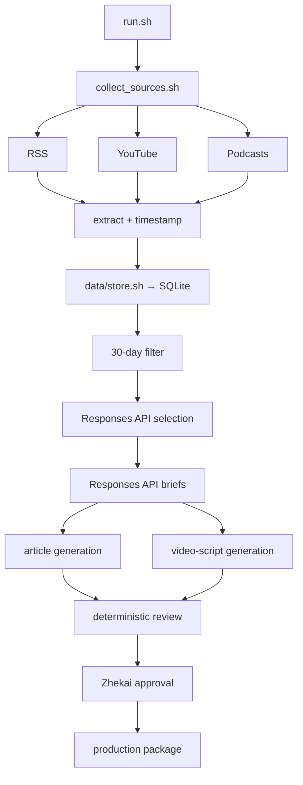

# Problem Set 4 Student Submission

Complete this document with your project details and links. Keep the course instructions in [README.md](README.md) and the required contracts in [ARCHITECTURE.md](ARCHITECTURE.md).

**Student:** Zhekai Li
**GitHub repository:** https://github.com/Zhekai-Li/ps04

## Topic and Audience

- **Publication name:** *Scholar in the Loop*
- **Topic:** Responsible uses of AI in research topic selection and academic writing.
- **Audience and assumed knowledge:** PhD students in artificial intelligence and operations research who already use LLM tools and understand research design, literature review, and academic publication.
- **Central question:** Which uses of AI in research topic selection and academic writing improve efficiency without weakening originality, evidentiary rigor, author responsibility, or scholarly value?
- **Scope and exclusions:** Includes topic discovery, research-gap evaluation, outlining, drafting, revision, citation verification, and disclosure. Excludes undergraduate cheating, generic workplace productivity, automated paper generation, fabricated citations, and unsupervised acceptance of AI conclusions.
- **Reason for readers to return:** Each edition re-evaluates practical workflows against new empirical evidence, policy changes, tool behavior, and researcher experience rather than assuming that an efficiency claim remains valid.

## Published Series

Replace each placeholder with the title or working link. Verify that course staff can open every publication.

| Piece | Title | Substack article | YouTube video |
| --- | --- | --- | --- |
| 1 | Pending argument from live evidence | Pending publication | Pending Unlisted upload |
| 2 | Pending argument from live evidence | Pending publication | Pending Unlisted upload |
| 3 | Pending argument from live evidence | Pending publication | Pending Unlisted upload |

**Separate technical demonstration video:** Pending Unlisted upload. Recording script: [`docs/technical_demo_script.md`](docs/technical_demo_script.md).

No publication is claimed by a placeholder. Titles and links will be filled only after evidence-grounded live runs, personal review, Google Vids production, publication, and signed-out access checks.

## Setup and Execution

Required local tools are Python 3.12, Bash, SQLite, `jq`, Git, `ffmpeg`, and `shellcheck`. The pinned Python dependencies are in `requirements.txt`.

```bash
bash scripts/setup.sh
export OPENAI_API_KEY='set-locally-never-commit'
bash scripts/check_openai.sh
```

The pipeline uses the OpenAI Responses API with strict JSON Schema Structured Outputs. The snapshotted defaults are `gpt-6.1-sol` for editorial/writing work and `whisper-1` only when publisher transcripts or YouTube captions cannot supply timestamps. Resolved models, usage, and known/estimated/unknown costs are recorded in receipts. See [`docs/account_setup.md`](docs/account_setup.md) for account steps. Only environment-variable names are documented; no secret value belongs in this repository.

Before each live run, audit `config/sources.json` for current access, relevance, publisher identity, and enough redundancy to yield at least 12 eligible items from six publishers. Topic settings live in `config/project.json`; selection rules in `config/editorial_policy.md`; and stage instructions in `prompts/`. Every run snapshots these files.

After implementation, the required entry commands are:

```bash
bash run.sh
bash run.sh --package runs/RUN_ID
```

Replace `RUN_ID` with an actual run directory. Add any setup or stage-replay commands a reviewer needs.

```bash
# independent stages
bash collectors/fetch_feeds.sh runs/RUN_ID
bash collectors/fetch_youtube.sh runs/RUN_ID
bash collectors/fetch_podcasts.sh runs/RUN_ID
bash processing/extract_content.sh runs/RUN_ID < runs/RUN_ID/candidates.jsonl
bash data/store.sh init
bash data/store.sh upsert runs/RUN_ID < runs/RUN_ID/items.jsonl
bash data/store.sh list
bash data/store.sh get ITEM_ID VERSION_ID

# labeled repeatability demonstrations
bash scripts/replay_run.sh runs/LIVE_RUN_ID
bash scripts/replay_run.sh runs/LIVE_RUN_ID path/to/withheld-candidates.jsonl
bash scripts/demonstrate_failure.sh youtube

# verification
.venv/bin/pytest -q
shellcheck run.sh workflows/*.sh collectors/*.sh processing/*.sh data/store.sh \
  editorial/*.sh content/*.sh review/*.sh publishing/*.sh reporting/*.sh scripts/*.sh
```

## Architecture and Manual Handoffs



The 16 required Bash files are public component boundaries. Focused modules under `src/` implement schemas, collectors, extraction, SQLite persistence, model calls, content generation, checking, packaging, and reporting. Only `data/store.sh` accesses `data/evidence/evidence.db`; all historical lookups go through its interface. Exact source text and transcript segments live in `data/assets/`. Full design and schema explanations are in [`docs/LEARNING_GUIDE.md`](docs/LEARNING_GUIDE.md).

The automated run ends at `awaiting_review`. Zhekai reviews `decisions.jsonl`, `briefs.jsonl`, the three articles, three scripts, exact evidence, and `review.json`; records corrections; and personally creates `approval.json` matching the current `review_id`. The system refuses missing, stale, or non-approving decisions. Packaging copies the reviewed work and generates per-piece source notes plus `package/PRODUCTION.md`.

The manual handoff uses `package/video_scripts/*.md` to build three 3–5 minute videos in Google Vids; `package/articles/*.md` for free Substack posts; and `package/source_notes/*.md` for viewer-facing attribution. YouTube uploads are Unlisted, articles and videos are cross-linked, and actual URLs are entered in `package/publication_links.json` only after signed-out verification. Media omitted from Git can be recovered using [`docs/media_retrieval.md`](docs/media_retrieval.md).

## Evidence and Runs

Link to the retained evidence, editorial decisions, briefs, content checks, and intermediate artifacts needed to inspect the complete workflow. Keep referenced text and transcript files accessible. Explain how to retrieve media omitted from the repository.

| Run | Actual date | Run artifacts and logs | Elapsed time | Approximate cost |
| --- | --- | --- | --- | --- |
| First live run | Pending actual execution | `runs/PENDING` | Pending receipt | Pending receipt |
| Second live run | Pending a different UTC date | `runs/PENDING` | Pending receipt | Pending receipt |

Live-run claims are intentionally pending until the runs occur. Each completed run will link `run.json`, `candidates.jsonl`, `items.jsonl`, `changes.jsonl`, `eligible.jsonl`, `exclusions.jsonl`, `decisions.jsonl`, `briefs.jsonl`, drafts/scripts, `review.json`, `summary.json`, and `logs/`. `summary.json` distinguishes known/estimated cost from unknown cost and reports new/changed/unchanged material, duplicate observations, incomplete collectors, and independent coverage.

Automated contract evidence currently lives in `tests/`: it verifies ordered starter-store replay behavior and historical retrieval, unchanged retrieval timestamps, inclusive date boundaries and all exclusion reasons, empty success versus simulated failure, strict-output retry behavior, claim resolution, review fingerprints, approval staleness, and link preservation. These fixtures do not count as live evidence. Actual replay and failure-run paths will replace `PENDING` here after execution.

Published-claim trace: `PENDING after publication`. The required trace format is documented in [`docs/LEARNING_GUIDE.md`](docs/LEARNING_GUIDE.md): publication claim marker → brief claim → accepted decision → `data/store.sh get ITEM_ID VERSION_ID` → exact text quote or transcript segment/timestamp → package source note.

## Editorial Review

Current policy: [`config/editorial_policy.md`](config/editorial_policy.md). Prompts: [`prompts/select_items.md`](prompts/select_items.md), [`prompts/create_briefs.md`](prompts/create_briefs.md), [`prompts/write_articles.md`](prompts/write_articles.md), and [`prompts/write_video_scripts.md`](prompts/write_video_scripts.md). Each actual run retains its exact copies under `runs/RUN_ID/config/` and `runs/RUN_ID/prompts/`.

The required personal comparison of three accepted and three rejected/deferred decisions is not fabricated in advance. Zhekai will complete [`docs/editorial_review.md`](docs/editorial_review.md) after live run one.

Policy-before, policy-after, changed decisions/synthesis, factual corrections, and final approval paths: `PENDING live run one and human review`. The pre-revision version will remain immutable in run one’s configuration snapshot; a subsequent run will snapshot the revised version.

## Reflection

The evidence-based insight, observed editorial limitation, and next improvement are `PENDING actual live results`; supplying them now would predetermine the reflection rather than report what the system produced.

The implemented architectural tradeoff is already clear: small Bash entry points and JSONL streams make every stage easy to replay, inspect, and demonstrate, but process boundaries provide less compile-time safety than one Python application. Typed Pydantic validation, deterministic hashes, immutable run snapshots, receipts, and a single storage owner mitigate that cost while preserving the assignment’s independently runnable interfaces.
