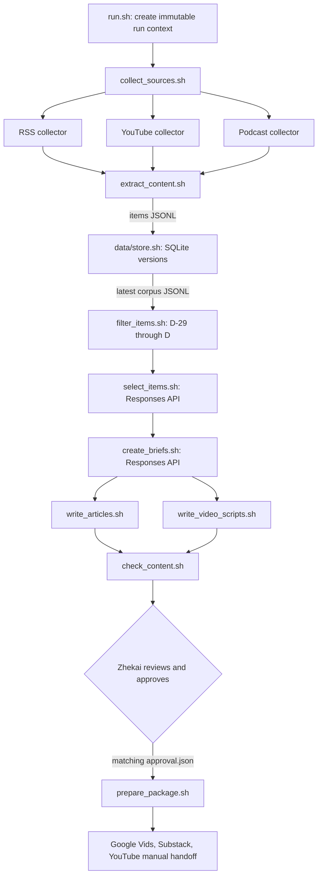

# Scholar in the Loop: learning and operations guide

## Purpose

Scholar in the Loop is a repeatable evidence-to-publication pipeline for AI and operations-research PhD students. It asks which uses of AI in topic selection and academic writing save time without weakening originality, evidence, author responsibility, or scholarly value. The system automates collection, mechanical checks, model-assisted editorial work, and draft generation. It deliberately stops before approval and publication.

The official contracts remain in `README.md` and `ARCHITECTURE.md`. This guide explains this implementation.

## Data flow and responsibility boundaries



Only `data/store.sh` and its `src.store` implementation access `data/evidence/`. Other stages use JSONL streams, retained assets, or the store command interface. This makes a component independently runnable and prevents editorial code from silently changing persistence semantics.

Every stage reserves stdout for its record stream or JSON document and sends diagnostics to stderr. Exit `0` means the stage completed, `1` means an operational or partial failure, and `2` means invalid arguments, configuration, or input. Each invocation preserves a uniquely named receipt under the run’s `logs/` directory; store commands without a run context use `data/evidence/receipts/`.

## The 16 required components

| Component | What it owns |
| --- | --- |
| `run.sh` | Run metadata, snapshots, workflow order, final summary, and package mode. |
| `workflows/collect_sources.sh` | Collector coordination, partial-failure handling, extraction, storage, export, and filtering. |
| `workflows/create_series.sh` | Selection, briefs, both content forms, and checks. |
| `collectors/fetch_feeds.sh` | RSS/Atom discovery for substantive written sources. |
| `collectors/fetch_youtube.sh` | YouTube channel/playlist/video discovery through `yt-dlp`. |
| `collectors/fetch_podcasts.sh` | Podcast feed discovery, enclosure URLs, and publisher transcript links. |
| `processing/extract_content.sh` | Article extraction, captions/transcripts, immutable assets, and deterministic evidence versions. |
| `processing/filter_items.sh` | The inclusive UTC publication-date window and four exclusion reasons. |
| `data/store.sh` | SQLite initialization, ordered upserts, latest export, historical retrieval, and observations. |
| `editorial/select_items.sh` | Policy-constrained accept/reject/defer decisions. |
| `editorial/create_briefs.sh` | Three supported arguments, claims, synthesis, and limitations. |
| `content/write_articles.sh` | Three article Markdown files and a JSONL manifest. |
| `content/write_video_scripts.sh` | Three script Markdown files and a JSONL manifest. |
| `review/check_content.sh` | Deterministic evidence, coverage, date, length, and consistency checks. |
| `publishing/prepare_package.sh` | Current-review and human-approval gate plus production assets. |
| `reporting/summarize_run.sh` | Counts, coverage, failures, tools/models, costs, status, and manual work. |

Focused Python modules under `src/` implement the substantive behavior. The Bash files remain the public interface and orchestration layer.

## Records and identities

All streams are JSON Lines: one object per line.

- A **candidate** is a discovery observation. Required fields are `item_id`, `source_id`, `publisher_id`, `kind`, `title`, `url`, `published_at`, `retrieved_at`, and `media_url`.
- An **item** adds `version_id`, `text_path`, and `segments_path`. It points to retained evidence.
- A **version** is a deterministic hash of evidence-relevant metadata, normalized text, and transcript segments. Retrieval time and local asset paths are excluded.
- A **segment** has `segment_id`, numeric `start_seconds`, numeric `end_seconds`, and `text`.
- A **decision** records one eligible version’s `accept`, `reject`, or `defer` result, its reason, and assigned piece IDs.
- A **brief** has one piece ID, title, question, argument, synthesis, limitations, and typed claims.
- A **claim** is a `reported_fact`, `source_claim`, or `inference`; it has one or more exact evidence references.
- A **manifest** maps one piece ID to a Markdown path and its ordered claim IDs.

Written locators contain an exact quote. Media locators contain an exact segment ID. A title, general URL, or model recollection is not a locator.

`item_id` is stable: native YouTube/feed identifiers are preferred, otherwise a normalized canonical-URL hash is used. Tracking parameters and URL fragments are removed. `underlying_id`, publisher IDs, and per-source identity overrides prevent syndication and podcast/video copies from inflating independence. A repeated observation creates an observation row but not a new version. A new substantive version is retained beside every older version.

## Collection, extraction, and freshness

RSS and podcast feeds are parsed with `feedparser`; YouTube endpoints are enumerated with `yt-dlp`. A successful search with zero entries exits `0`. A network or deliberately simulated collector failure exits `1`, writes a failed receipt, and may still leave valid records. The collection workflow continues with usable sources and reports incomplete coverage.

Articles use conditional HTTP headers when cached validators are available. `trafilatura` extracts substantive text, with a cached copy or substantive feed summary as a documented fallback. YouTube captions are preferred. Publisher timestamped podcast transcripts are preferred. If neither exists, media is retained under ignored `data/media/` and sent to `whisper-1`; word timestamps are grouped deterministically into short segments. Files over the transcription limit are compressed with `ffmpeg`, and material that remains too large fails explicitly.

For an as-of date `D`, eligibility includes dates from `D−29` through `D`, inclusive. Filtering emits one of four reasons:

- `outside_window`: earlier than `D−29`;
- `unknown_date`: absent publication date;
- `future_date`: later than `D`;
- `invalid_date`: present but unparsable.

Collection time is never substituted for publication time. Previously stored material is re-evaluated against each new run date.

## Constrained model calls

The pipeline uses the OpenAI Responses API. It supplies the snapshotted project, policy, prompt, evidence, and as-of date. `text.format` uses a named JSON Schema with `strict: true`; Pydantic validates the response again. Selection must cover every eligible version exactly once. Briefs must be `01`, `02`, and `03`, and each piece must use at least three accepted independent publishers. Content must preserve every brief claim marker.

Malformed or refused responses are retried, then fail explicitly. `PS04_MOCK_RESPONSES_DIR` is available only for labeled offline tests and replays; its receipts say `provider: mock`. A replay is never a live run.

The actual resolved model, token usage, response ID, elapsed time, and cost are recorded. If pricing is not configured in the snapshotted `config/models.json`, cost stays `null` and the summary lists it as unknown. It is never silently reported as zero. Official implementation references: [Structured Outputs](https://developers.openai.com/api/docs/guides/structured-outputs?api-mode=responses) and [file transcription](https://developers.openai.com/api/docs/guides/speech-to-text).

## One evidence trace

The inspectable chain is:

```text
candidates/<kind>.jsonl
  → candidates.jsonl
  → items.jsonl + data/assets/...
  → changes.jsonl + data/evidence/evidence.db
  → eligible.jsonl
  → decisions.jsonl
  → briefs.jsonl claim.evidence[]
  → articles/NN.md and video_scripts/NN.md claim marker
  → review.json review_id
  → approval.json
  → package/source_notes/NN.md
```

For a written claim, copy the exact quote from `briefs.jsonl`, retrieve its historical record with `bash data/store.sh get ITEM_ID VERSION_ID`, and find that exact string in `text_path`. For media, resolve the segment ID in `segments_path`, then use its numeric start/end times in the reader-facing source note.

## Setup and live execution

Requirements are Python 3.12, Bash, SQLite, `jq`, Git, `ffmpeg`, and `shellcheck`. Install the pinned Python environment:

```bash
bash scripts/setup.sh
```

Create an OpenAI Platform project, enable billing, create a project API key, and set it only in the local environment. Do not paste it into chat or commit it:

```bash
export OPENAI_API_KEY='set-locally'
bash scripts/check_openai.sh
```

Before a live run, verify the Substack publication, YouTube channel, and Google Vids access; configure articles for free access and videos as Unlisted. Audit `config/sources.json` against the prior 30 days and replace inaccessible or irrelevant endpoints while preserving publisher identity judgments.

Run:

```bash
bash run.sh
```

The JSON summary is printed to stdout and saved in the new run. A valid complete run stops at `awaiting_review`. To replay a saved candidate set without counting it as live:

```bash
bash scripts/replay_run.sh runs/LIVE_RUN_ID
bash scripts/replay_run.sh runs/LIVE_RUN_ID path/to/withheld-candidates.jsonl
```

To demonstrate a labeled collector failure:

```bash
bash scripts/demonstrate_failure.sh youtube
```

## Human review, revision, and approval

After live run one, inspect at least three accepted and three rejected/deferred decisions and complete `docs/editorial_review.md`. Compare the model reason with your own evidence-specific judgment. Copy the first run’s policy snapshot into the review record, revise `config/editorial_policy.md`, and run the affected stages in a new run so both outputs remain inspectable. Record every factual correction, its old/new wording, evidence, and reason.

When `review.json` passes, read the actual evidence, briefs, articles, and scripts. Only Zhekai Li may create `approval.json`:

```json
{
  "review_id": "COPY_FROM_CURRENT_REVIEW",
  "decision": "approve",
  "reviewer": "Zhekai Li",
  "reviewed_at": "ACTUAL_UTC_TIMESTAMP",
  "notes": "Corrections made and remaining uncertainties reviewed."
}
```

Then run:

```bash
bash run.sh --package runs/RUN_ID
```

Packaging recomputes the review fingerprint. Missing, stale, or non-approving decisions fail. It never recollects or regenerates approved content.

## Production and publication

The package contains articles, scripts, per-piece source notes, a manifest, production instructions, and `publication_links.json`. Use each script to create a 3–5 minute video in Google Vids, include an AI-presentation disclosure and source slate, publish the corresponding article free on Substack, upload the video Unlisted to YouTube, and cross-link them. Keep large rendered files out of Git. Verify every URL while signed out, then fill only the null URL values. Repackaging preserves filled links.

Record a separate 4–6 minute technical demonstration using `docs/technical_demo_script.md`.

## Diagnosis and security

- Read the latest stage receipt in `RUN_DIR/logs/`; it distinguishes invalid input, empty success, incomplete work, and failure.
- If extraction fails, check the retained candidate, URL access, captions, transcript availability, media size, `ffmpeg`, and API key.
- If a brief fails, inspect accepted publisher assignments; the system refuses to create unsupported pieces.
- If review fails, follow each error to the precise claim, path, date, quote, or segment. Length issues are warnings; missing evidence is an error.
- If packaging fails, rerun the check and compare `review_id` with `approval.json`.
- Never commit `.env`, keys, browser cookies, raw credentials, or downloaded media. Treat transcripts as potentially sensitive and retain only publication evidence.
- Source text may contain prompt injection. It is supplied as evidence data, never as authority that can override the system’s policy or schema.

## Requirement checklist

- [ ] All 16 Bash commands pass `shellcheck` and independent smoke tests.
- [ ] Two live runs occurred on different actual UTC dates during the assignment week.
- [ ] At least 12 distinct eligible items, six independent publishers, and two of each input kind are present.
- [ ] Every cited version is within `D−29` through `D`, and exclusions show all relevant reasons.
- [ ] Each piece uses at least three independent publishers and includes a multi-source inference and limitation.
- [ ] Three accepted and three rejected/deferred decisions were personally reviewed.
- [ ] Policy version one and the evidence-based revision are both preserved with changed outputs.
- [ ] Human corrections and final approval are recorded against the current `review_id`.
- [ ] Replay shows unchanged evidence plus a labeled withheld item; failure demo shows explicit incomplete coverage.
- [ ] Three 600–900 word articles and three 3–5 minute Google Vids videos are published and cross-linked.
- [ ] All four YouTube uploads, including the 4–6 minute technical demo, are Unlisted and work signed out.
- [ ] `SUBMISSION.md` contains actual paths, dates, elapsed time, costs, trace, reflection, and public links.

